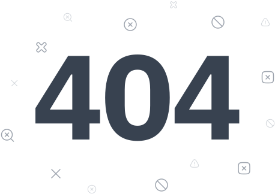

<section id="statusOverview" class="nds-content-section nds-doc-overview">
  

    

      <h2 class="nds-section-title">Overview</h2>
    

    

A status section is a content section or a hero section with the `nds-status-section` class. It stacks a feedback chip or an illustration, a title, a description and an action row in one centered column. Use it as a whole page, such as an error page or a confirmation page, or as one section of a longer page. It needs no JavaScript.

Pick another component when:

- the message sits inside a form or a region of the page: [Alert](../components/alert)
- the status needs only an icon and a line of text: [Feedback Icons](../components/feedback-icons)

  

</section>

<section id="statusMarkup" class="nds-content-section nds-doc-markup nds-demo-section">
  

    

      <h2 class="nds-section-title">Markup</h2>
    

    

    

  

</section>

<section id="statusVariants" class="nds-content-section nds-doc-variants" hidden>
  

    

      <h2 class="nds-section-title">Variants</h2>
    

    

| Group | Option | Markup | On element | Use |
|---|---|---|---|---|
| Structure | Icon (default) | — | — | A feedback chip above the title. Most outcome messages |
| Structure | Illustration (id: illustration) | canon `#status-image` | — | A page with its own artwork, such as the 404 page. It takes no status |
| Status | Success (default) (not: illustration) | — | `.nds-status-section` | The work completed. Green title, check mark |
| Status | Info (not: illustration) | `[data-status="info"]` | `.nds-status-section` | A plain notice. Blue title, "i" |
| Status | Warning (not: illustration) | `[data-status="warning"]` | `.nds-status-section` | The work needs attention. Yellow title, exclamation mark |
| Status | Error (not: illustration) | `[data-status="error"]` | `.nds-status-section` | The work failed. Red title, cross |
| Status | Critical (not: illustration) | `[data-status="critical"]` | `.nds-status-section` | A failure the user must act on now. Red title, exclamation mark |
| Status | Help (not: illustration) | `[data-status="help"]` | `.nds-status-section` | A pointer to help. The title keeps its own color, and the chip shows a question mark |
| Chip | Outline | `.nds-outline` | `.nds-feedback` | The chip shows an outlined icon instead of a solid disc. The ring stays |
| Second action | Second action | canon `#status-second-action` | `.nds-section-action` | A second way out beside the main one, such as Try Again |
{: #statusVariantsTable .nds-table .nds-responsive}

  

</section>

<section id="statusFeatures" class="nds-content-section nds-doc-features">
  

    

      <h2 class="nds-section-title">Built-in Features</h2>
    

    

      

        

          
            <i class="hgi hgi-stroke hgi-text-align-center"></i>
            Centered Parts
          
          
The section centers its parts with the same rules as a section with <code class="nds-inline-code lang-html">nds-center</code>. It needs no extra class.

        

        

          
            <i class="hgi hgi-stroke hgi-arrow-expand"></i>
            Height Fill
          
          
In the page layout, the section grows to fill the height the other sections leave, and it centers its content in that height. A short message on its own page sits in the middle of the screen.

        

        

          
            <i class="hgi hgi-stroke hgi-align-box-middle-center"></i>
            Chip Size
          
          
A feedback chip in the section is 56px wide, with no size class.

        

      

    

  

</section>

<section id="statusPractices" class="nds-content-section nds-doc-practices">
  

    

      <h2 class="nds-section-title">Best Practices</h2>
    

    

- Put a whole-page status section in the [page layout](../layout/page-layout).
- On its own page, the title is the page heading: use `h1`. In a longer page, follow the page's heading order.
- Write the outcome in the title and what happens next in the description. Keep both short.
- Pick the status by meaning, not by color: `success` for work that completed, `error` for work that failed, `critical` for a failure the user must act on now, `warning` for work that needs attention, `info` for a plain notice.
- Use an illustration only on a page with its own artwork, and a chip everywhere else. Never use both.
- Give an illustration an empty `alt` when the title says the same thing.
- Give the user a way out in the action row: back to the home page, back to the service, or try again. Never ship a status page with no link.
- Make one action primary. A second action takes a secondary style.

  

</section>

<section id="statusApi" class="nds-content-section nds-doc-api">
  

    

      <h2 class="nds-section-title">API</h2>
    

    

### Data Attributes
{: .nds-block-title}

| Attribute | Element | Effect |
|---|---|---|
| `data-status` | the `.nds-status-section` element | `success`, `info`, `warning`, `error`, `critical` or `help`. Sets the title color, and the icon and colors of the feedback chip inside the section. `error` and `critical` both color the title red. `help` leaves the title color as it is. The chip carries no status of its own. Leave it out on a section with an illustration |
{: .nds-table .nds-responsive}

### CSS Custom Properties
{: .nds-block-title}

| Property | Default | Controls |
|---|---|---|
| `--feedback-size` | `56px` | The diameter of the feedback chip. Set it in the `style` of the section or of the chip. See [Feedback Icons](../components/feedback-icons) |
{: .nds-table .nds-responsive}

  

</section>

<section id="statusRelated" class="nds-content-section nds-doc-related">
  

    

      <h2 class="nds-section-title">Related</h2>
    

    

- [404 Template](../templates/404-template): a whole page with the illustration structure.

  

</section>
